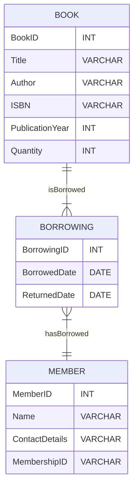

---
# try also 'default' to start simple
theme: seriph
# random image from a curated Unsplash collection by Anthony
# like them? see https://unsplash.com/collections/94734566/slidev
background: https://source.unsplash.com/collection/94734566/1920x1080
# apply any windi css classes to the current slide
class: 'text-center'
# https://sli.dev/custom/highlighters.html
highlighter: shiki
# show line numbers in code blocks
lineNumbers: false
# some information about the slides, markdown enabled
info: |
  ## Slidev Starter Template
  Presentation slides for developers.

  Learn more at [Sli.dev](https://sli.dev)
# persist drawings in exports and build
drawings:
  persist: false
# use UnoCSS (experimental)
css: unocss
---

# Entity-Relationship (ER) Diagrams

An overview

  
    next <carbon:arrow-right class="inline"/>
  

  <button @click="$slidev.nav.openInEditor()" title="Open in Editor" class="text-xl icon-btn opacity-50 !border-none !hover:text-white">
    <carbon:edit />
  </button>
  <a href="https://github.com/slidevjs/slidev" target="_blank" alt="GitHub"
    class="text-xl icon-btn opacity-50 !border-none !hover:text-white">
    <carbon-logo-github />
  </a>

<!--
The last comment block of each slide will be treated as slide notes. It will be visible and editable in Presenter Mode along with the slide. [Read more in the docs](https://sli.dev/guide/syntax.html#notes)
-->

---

# Understanding ER Diagrams

- ER (Entity-Relationship) Diagrams are visual representations used in database design to illustrate the logical structure and relationships between entities in a system.
  
- ER Diagrams help in conceptualizing and designing databases by providing a clear overview of entities, their attributes, and the relationships between them.

- **Components of ER Diagrams:**
  - **Entities:** Represent real-world objects or concepts, such as people, places, or things, with attributes describing them.
  - **Relationships:** Show connections and interactions between entities, defining how they are related to each other.
  - **Attributes:** Characteristics or properties of entities that provide further details about them.

---

# Understanding ER Diagrams

- ER Diagrams serve as a blueprint for database implementation, aiding in better understanding, communication, and maintenance of the database structure.

- ER Diagrams use symbols and notations to depict entities, attributes, and relationships, making it easier to visualize database designs.

---

# Entities in ER Diagrams

- Entities represent real-world objects, concepts, or things within a system that are identifiable and distinguishable.
  
- Entities can include various elements such as Students, Books, Employees, Customers, etc.
  
- Entities are typically depicted as rectangles in ER Diagrams.
  - Each entity has attributes that describe its properties or characteristics.
  - Entities are identified uniquely by their primary keys in a database.
  
- Entities form the core components of a database schema, defining the structure of data storage.

- Entities facilitate organizing and categorizing information in the database system.

---

# Attributes in ER Diagrams

- Attributes are properties or characteristics that describe entities in a database.
  
- **Types of Attributes:**
  - *Simple Attributes:* Represent single atomic values (e.g., Name, Age).
  - *Composite Attributes:* Composed of multiple smaller attributes (e.g., Address: Street, City, Zip Code).
  - *Derived Attributes:* Calculated or derived from other attributes (e.g., Age can be derived from Date of Birth).
  
- **Examples of Attributes:**
  - Attributes could be Name, ID, ISBN, Title, Author, Quantity, etc.

---

# Attributes ...contd

- Attributes are usually depicted as ovals connected to respective entities.
  
- Attributes provide details and specific information about entities, defining their characteristics.
  
- Attributes help in organizing and storing data efficiently within the database.

---

#### Relationships in ER Diagrams

- Relationships establish connections and associations between entities in a database system.
  
- **Types of Relationships:**
  - *One-to-One (1:1):* Each entity in the relationship is associated with only one entity in the other side.
  - *One-to-Many (1:M):* One entity in a relationship is associated with multiple entities in the other side.
  - *Many-to-Many (M:N):* Entities on both sides can be associated with multiple entities on the other side.

- Example: A Student borrows many Books; a Book can be borrowed by many Students.
  
---

#### Relationships ...contd.

- Relationships are typically depicted as diamonds connected to related entities.
  
- Relationships define how entities interact and relate to each other in a database schema.
  
- Relationships establish the logical connections between entities, shaping the database structure.

---

#### Example

---

<!-- https://www.mermaidchart.com/app/projects/21030e5e-873f-4377-bb62-3dae3e10870f/diagrams/b2b98989-b71a-43ac-b539-a27454399c7e/version/v0.1/edit -->

